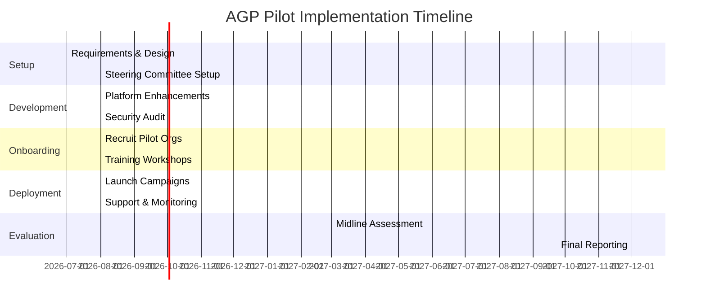

# Amanah Governance Platform (AGP) Grant Proposal

## Speaker Summary (Highlights)

### ver 1
- **Funding Request:** Seeking RM550,000 for a 12-month pilot to launch the Amanah Governance Platform (AGP), a national digital infrastructure for Islamic charities and mosque funding.  
- **Problem:** Malaysia’s philanthropic sector is large (~RM multi-billion zakat flows, 6,800+ mosques, 80K NGOs【32†L215-L222】【33†L68-L72】) but fragmented, with limited transparency and outdated manual processes. Public trust is strained by fund misuse incidents【21†L125-L133】 and donors demand accountability.  
- **Solution:** AGP integrates governance assessment, an **Amanah Index** (trust score), evidence management, and non-custodial donation rails. It provides real-time transparency: donors, scholars, and regulators see donation flows and organizational compliance. Modules include organizational dashboards, scholar reviewer workflows for Shariah compliance, and robust data governance.  
- **Pilot:** 
- Option 1: Formal Proposal Style (Best for stakeholders/SIRC)
1. Pilot Phase: Strategic Implementation
The pilot will be executed in collaboration with State Islamic Religious Councils (SIRC/MAIN), leveraging their role as the primary statutory bodies governing Islamic affairs, including Zakat, Waqf, and Baitulmal. Given their mandate under state enactments, the SIRC provides the necessary legal framework and oversight for the collection and distribution of funds. 
2. Scope and Deployment
Target: Deployment to approximately 20 mosques and NGOs within the state of Selangor.
Duration: 3 months.
Key Activities:
Onboarding & Training: Specialized workshops for mosque committees and NGO administrators to ensure digital literacy and compliance.
Campaign Management: Launching and managing automated recurring donation campaigns to stabilize monthly cash flow.
Data Collection: Gathering real-time insights on donor behavior and fund utilization.
3. Impact Measurement (KPIs)
Success will be measured through three primary pillars:
Growth: Increase in total volume and frequency of recurring donations.
Trust: Improvement in transparency scores through digitized reporting.
Governance: Enhanced oversight efficiency for the SIRC over distributed mosque funds.
Option 2: Executive Summary (Best for a Slide Deck)
Pilot Overview: Selangor State Implementation
Governance Partner: State Islamic Religious Councils (SIRC). We utilize the existing statutory framework (Zakat, Waqf, and Baitulmal administration) to ensure Shariah compliance and legal accountability.
Execution: A 12-month rollout across 20 mosques/NGOs in Selangor.
Core Activities: Organization onboarding, training, and the execution of automated recurring donation campaigns.
Success Metrics:
↑ Recurring donation volume.
↑ Transparency & reporting scores.
↑ Operational oversight efficiency.
- **Impact:** Strengthens mosque/NGO sustainability; reduces dependency on aid. Builds donor trust and a culture of digital giving. Creates a model to scale nationally and integrate with zakat authorities’ initiatives (e.g. blockchain-based e-Wakalah pilot【56†L476-L484】).  
- **Budget & Sustainability:** RM550K for development, training, operations (see table). Long-term revenue from subscriptions and transaction fees. Risks (adoption, tech) mitigated via phased rollout and stakeholder support.  
- **Governance:** Led by a joint committee (zakat boards, tech, Shariah experts) with clear roles. Complies with data protection and Shariah standards.  
- **Timeline:** July 2026 – Dec 2027 (see Gantt). Phases: planning, dev, onboarding, pilot operation, evaluation.  
- **Call to Action:** Support AGP as strategic infrastructure for Malaysia’s social finance, aligning with national goals (Maqasid al-Shariah, SDGs).  

### ver 2
Executive Prospectus: Amanah Governance Platform (AGP)
1. Executive Summary & Funding Request
We are seeking RM550,000 in seed funding to launch the Amanah Governance Platform (AGP). AGP is designed as Malaysia’s national digital infrastructure for Islamic charities and mosque funding, transforming the philanthropic landscape through data-driven transparency and Shariah-compliant governance.
2. The Problem: A Fragmented Philanthropic Landscape
Despite Malaysia’s robust Islamic economy—comprising multi-billion ringgit Zakat flows, 6,800+ mosques, and 80,000 NGOs—the sector remains highly fragmented.
Operational Gaps: Reliance on outdated manual processes and non-standardised reporting.
Trust Deficit: Public confidence is frequently strained by high-profile fund misuse, leading to a growing demand for real-time accountability and verifiable impact.
3. The Solution: The AGP Ecosystem
AGP introduces a unified digital layer for the social finance sector:
Amanah Index: A proprietary "Trust Score" based on governance assessments.
Non-Custodial Rails: Secure, direct donation flows that eliminate intermediary risks.
Real-Time Transparency: Integrated dashboards for donors, scholars, and regulators to monitor fund utilization and Shariah compliance.
Evidence Management: A digital repository for proof-of-impact, ensuring every Ringgit is accounted for.
4. Pilot Phase: Strategic Implementation (Selangor)
Strategic Partner: State Islamic Religious Councils (SIRC/MAIN). By aligning with the statutory bodies governing Zakat and Waqf, AGP ensures full legal and Shariah legitimacy.
Deployment: A 12-month pilot targeting 20 mosques and NGOs within the State of Selangor.
Core Activities:
Digitizing mosque committees through specialized onboarding.
Launching automated recurring donation campaigns to ensure institutional sustainability.
Key Performance Indicators (KPIs):
Growth: Increased frequency and volume of recurring digital giving.
Trust: Measurable improvement in transparency scores via the Amanah Index.
Efficiency: Streamlined oversight for SIRC over distributed mosque funds.
5. Strategic Impact & Sustainability
AGP reduces institutional dependency on ad-hoc aid by building a culture of sustainable, recurring digital giving. The platform is built to scale nationally, offering a blueprint for integration with future national initiatives, such as blockchain-based e-Wakalah systems.
Revenue Model: Long-term sustainability through tiered subscription fees and nominal transaction processing.
Risk Mitigation: Phased rollout and joint-committee oversight to manage adoption and technical hurdles.
6. Governance & Timeline
The project is overseen by a Joint Steering Committee comprising Zakat boards, Fintech specialists, and Shariah scholars.
Execution Timeline: July 2026 – December 2027.
Phases: Strategic Planning → Platform Development → Onboarding → Pilot Operations → Impact Evaluation.
7. Call to Action
Invest in AGP to build the strategic infrastructure of Malaysia’s future social finance. Together, we can align the philanthropic sector with Maqasid al-Shariah and national digital transformation goals, ensuring every contribution creates a lasting, transparent impact.

### ver 3 
Speaker Topic: Digitizing Trust – The Amanah Governance Platform (AGP)
The Vision
Transforming Malaysia’s RM multi-billion Islamic philanthropic sector into a transparent, high-trust digital ecosystem. With 6,800+ mosques and 80k NGOs, the sector is ripe for a "trust revolution."
The Problem
Fragmentation and manual processes have strained public confidence. Today’s donors demand real-time accountability that traditional systems simply cannot provide.
The Solution: AGP
The Amanah Governance Platform (AGP) is a national-grade digital infrastructure featuring:
The Amanah Index: A proprietary trust score for charities.
Smart Governance: Real-time dashboards for scholars, regulators, and donors.
Non-Custodial Rails: Secure, direct donation flows with Shariah-compliant evidence management.
The Pilot: Selangor Implementation
In partnership with State Islamic Religious Councils (SIRC), we are launching a 12-month pilot across 20 mosques and NGOs in Selangor. This phase focuses on:
Digital Onboarding: Equipping mosque committees with modern financial tools.
Recurring Giving: Moving from ad-hoc donations to sustainable, automated monthly flows.
Measurable Impact: Boosting transparency scores and oversight efficiency for state authorities.
The Future
By bridging the gap between Maqasid al-Shariah and Fintech, AGP reduces aid dependency and builds a national model for digital giving—aligning perfectly with Malaysia’s SDGs and blockchain-ready future.
Funding Goal: RM550,000 | Timeline: July 2026 – Dec 2027

## Executive Summary

Malaysia’s Islamic philanthropy system (zakat, waqf, mosques, NGOs) mobilizes billions in aid each year【32†L215-L222】, but lacks unified digital infrastructure for transparency. The Amanah Governance Platform (AGP) addresses this gap. AGP will be a national “trust and transparency” platform connecting donors, mosques, NGOs, zakat authorities, and scholars. It provides **non-custodial donation rails** (donations go directly to charities) plus governance tools: organizational profiles, audit evidence management, and a public trust rating (the Amanah Index). 

In a 12-month pilot (10–30 organizations), AGP will be tested in a Malaysian context (e.g. Selangor). Participants (mosques and NGOs) will be onboarded and trained, run recurring fundraising campaigns via AGP, and provide reporting data. Key Performance Indicators (KPIs) include the growth in recurring donations, improvements in transparency scores, and reductions in administrative burden for regulators. Data from the pilot will be used to refine the platform and demonstrate impact. 

The requested budget (RM550K) covers platform development, training, operations, and evaluation (detailed in Budget table). Post-pilot, AGP can scale nationwide via modest subscriptions or transaction fees, in partnership with state zakat boards. This proposal aligns with Malaysia’s social finance objectives (modernizing zakat/waqf management and enhancing transparency)【26†L316-L324】. We invite zakat authorities and grant funders to support AGP as a strategic investment in community resilience and donor confidence.

## Background and Context

- **Zakat (Almsgiving):** Malaysia’s twelve state zakat boards collect and distribute zakat (mandatory donations) each year. Collections exceed RM2–3 billion nationwide (e.g. Selangor’s LZS collected ~RM1.22B in 2024【32†L215-L222】). These funds support hundreds of thousands of eligible asnaf households. Modern channels (salary deductions, online direct debits) are growing rapidly (LZS reports +60% growth in direct debit)【30†L165-L170】, reflecting public confidence in formal systems.  
- **Waqf (Endowments):** Malaysia holds *tens of thousands of hectares* of waqf property (est. 35,727 ha in total【26†L180-L188】). However, utilization is often low. For example, only ~2,477 of 5,928 acres (42%) of Johor’s registered waqf land are developed【28†L1039-L1047】. Unused waqf assets represent missed potential for community development. Better data and governance are needed to harness these resources.  
- **Mosques and Religious NGOs:** Malaysia has thousands of mosques (Sabah alone has 1,127 mosques and 1,222 surau【10†L125-L133】; nationwide campaigns speak of ~6,800 mosques being activated【33†L68-L72】) and tens of thousands of NGOs (an estimated 82,675 registered in 2021【16†L260-L268】). Many of these grassroots organizations depend on public donations (cash & digital) for operations, education, and social services. Typically, financial reporting in these settings is informal or infrequent.  
- **Regulatory Landscape:** NGOs and charity organizations are overseen by the Registrar of Societies (ROS) and state Islamic councils. ROS recently emphasized stricter reporting compliance, following cases of fund misuse (e.g. accounts frozen by MACC)【21†L125-L133】. State Islamic councils (e.g. MAIWP, APB) administer zakat with structured processes, but small charities and mosques often fall outside rigorous auditing, leading to potential governance gaps.  
- **Donor Expectations:** Malaysian donors remain generous, but studies indicate increasing concern over how donations are used and a desire for impact transparency. (A nationwide survey notes that Malaysian donors typically give RM200–RM500 but are guided by trust and effectiveness factors, reshaping donation patterns.) Internationally, charity rating systems (e.g. U.S. Charity Navigator) show that transparency metrics directly influence giving【45†L267-L272】. No similar standardized platform exists yet for Malaysian Islamic charities.

**Challenges:** The current system is **fragmented and manual**. Zakat boards, waqf agencies, and community mosques operate largely independently, with limited data sharing. Financial records (e.g. donation logs, distributions) are often paper-based or siloed spreadsheets. This fragmentation makes it hard for donors to verify credibility and for regulators to monitor compliance in real time. For example, many waqf lands are unregistered or underutilized due to poor data【26†L180-L188】, and numerous small NGOs do not publish audited accounts. The result is redundancy (multiple agencies performing similar audits) and reactionary oversight (investigating only after scandals). 

**Opportunity:** Digital tools can radically improve trust. Blockchain pilots like LZS’s e-Wakalah proof-of-concept have already demonstrated that immutable, auditable ledgers can transform Zakat distribution【56†L476-L484】. There is now momentum in Malaysia to modernize Islamic finance (e.g. RM250M waqf development funds allocated【26†L316-L324】). AGP builds on these trends by providing a unified transparency platform, raising governance standards and enabling donors to give with confidence.

【69†embed_image】 *Figure: Conceptual illustration of a cloud-based platform architecture. AGP will integrate databases, analytics, and user interfaces in a secure cloud environment (illustrative image).*

## Problem Statement

Malaysia’s Islamic social finance sector suffers from **trust and efficiency gaps**:

- **Lack of Unified Transparency:** There is no central registry or portal for charity data. Donors cannot easily cross-check if an organization is compliant or how funds are allocated. Unlike formal zakat agencies, many grassroots groups do not publicly disclose donation use, leading to information asymmetry.
- **Manual and Incomplete Reporting:** Annual reports or financial statements of NPOs in Malaysia often omit key data. A study of 205 Malaysian NPOs found that while over 50% disclosed income sources, only ~25% reported fundraising costs【41†L97-L105】. Fundraisers and mosques typically maintain manual ledgers, delaying accountability.
- **Oversight Burden:** Regulators (ROS, JAKIM, state zakat councils) must audit tens of thousands of organizations. ROS noted compliance challenges and has taken actions like freezing rogue accounts【21†L125-L133】. State zakat boards similarly have limited staff to verify each beneficiary. Without digital records, audits are time-consuming and error-prone.
- **Underutilized Funds:** Inefficient management leads to wasted resources. Idle waqf land (as noted above) and underfunded mosques often coexist in wealthy neighborhoods, reflecting misalignment. A trust platform can highlight these discrepancies.
- **Donor Hesitancy:** Scandals (e.g. high-profile fund diversions) have made contributors cautious. Research and surveys suggest that donors (especially younger, tech-savvy Malaysians) will increasingly prefer platforms that demonstrate impact and accountability (paralleling global trends in NGO accountability).

In summary, while Malaysia’s Muslim community gives generously (bills like RM1B+ collected per year in major states【32†L215-L222】), the **lack of digital governance infrastructure** limits growth. The system currently relies on informal trust; a platform like AGP would introduce data-driven trust to multiply giving and ensure funds reach intended causes.

## Literature & Best Practices

Several international and domestic precedents illuminate AGP’s design:

- **Charity Rating Platforms (USA, UK):** Charity Navigator and GuideStar compile IRS/financial data to rate nonprofits on financial health, accountability, and transparency【45†L267-L272】. Donors use these ratings to make informed choices. Similarly, the UK’s Charity Commission publishes registry data and Spotlight (on research by CAF) highlights giving trends. These show donors give more when they trust the organization’s governance.
- **Blockchain-Based Philanthropy:** The LZS-Masverse e-Wakalah pilot (Oct 2025) demonstrated one model: Zakat funds were distributed via a blockchain-based wakalah contract【56†L476-L484】. Each transaction was immutable and traceable; beneficiaries withdrew directly to bank accounts with all transfers recorded on-chain【56†L482-L490】. This automated many manual checks, “redefin[ing] transparency, efficiency, and accountability”【56†L442-L450】. AGP can incorporate similar ledger techniques for audit trails.
- **Islamic Crowdfunding Research:** Academic studies (e.g. *JIABR*, 2025) show that blockchain can significantly enhance trust in Islamic crowdfunding, by providing verifiable digital records【62†L113-L122】. Other research on Malaysian zakat tech (e.g. case study “Asnaf Care” platforms) emphasize ease of use and trust-building as key success factors.
- **Local Initiatives:** Malaysian zakat bodies have begun digital offerings. Example: LZS’s blockchain project, and iWaqf (private platform for waqf contributions)【47†L1-L9】. Malaysia’s National Islamic Council (JAKIM) and Bank Islam have also explored Islamic fintech pilots. However, these efforts remain siloed. AGP’s novelty is to unify data across organizations (not just zakat funds).
- **NPO Reporting Standards:** Studies confirm Malaysian charities need stronger governance disclosure. The 2017 study【41†L97-L105】 cited above concludes that Malaysian NPOs’ disclosures are “relatively weak” overall. Proposed solutions include standardized reporting frameworks. AGP implements this recommendation by providing a guided assessment and mandatory fields for financials.
- **Waqf & Governance:** Literature on waqf administration (e.g. Hasan 2008【26†L180-L188】) repeatedly notes that poor record-keeping impedes development. In practice, state awqaf have struggled with overlapping jurisdiction. A digital registry (part of AGP) can clarify ownership and encourage sustainable waqf projects.

Together, these examples illustrate that **data-driven trust frameworks** boost giving and efficiency. AGP draws on these lessons by embedding rigorous reporting in the donation process, ensuring compliance without stifling generosity.

## Solution: Amanah Governance Platform

AGP is a **web-based, modular platform** designed to enhance transparency and trust in Islamic philanthropy. Key components include:

- **Multi-Tier Architecture:** A secure cloud environment hosts the application (illustrated in Figure below). Role-based access includes: *Donors* (public, read-only access to basic scores and campaign pages), *Orgs/Trustees* (administrators who upload data and request donations), *Reviewers/Scholars* (zakat officers or Shariah scholars who verify data), and *Admins*. Back-end databases store encrypted records of finances, scores, and logs. An audit ledger (optionally blockchain-based) records critical transactions and approvals. Interactions between modules occur via secured APIs.
- **Organization Profiles & Assessment:** Each mosque/NGO completes a structured profile (leadership, programs, finance). A guided governance questionnaire scores attributes (e.g. existence of audited accounts, board oversight, financial controls). These inputs feed the **Amanah Index** – a composite trust score (0–100) covering categories like Financial Transparency, Governance, Impact, and Shariah Compliance. (An example component breakdown is suggested in Appendix.) Higher Amanah scores (displayed as badges) signal healthier governance.
- **Evidence Management:** Organizations can upload key documents (audit reports, zakat permits, waqf deeds, annual budgets) as “evidence.” The platform supports tagging, versioning, and expiry notifications (e.g. re-upload needed each year). Assigned reviewers (state zakat officers or third-party auditors) can attest to each document via a built-in workflow. Completed approvals enhance the Amanah score.
- **Donation Portal (Non-Custodial Rails):** Donors access a simple portal to support any registered organization. Upon selecting a cause, the portal redirects the payment (via FPX, eWallet, or QR code) directly to the organization’s pre-verified bank account. AGP itself never holds funds (ensuring non-custody compliance). However, AGP tracks each donation event. Receipts (e-kuitansi) are auto-generated. Optional “purpose-bound” tags (inspired by e-Wakalah) ensure funds are earmarked (e.g. “Zakat – Baitulmal Car Repair”) to avoid misuse【56†L493-L502】.
- **Reviewer & Scholar Workflows:** A dedicated interface lists organizations pending review. Officials and scholars can examine profiles and evidence, then issue certifications (e.g. “Zakat-eligible”, “Sadaqah-compliant”). This collaborative review ensures Shariah and legal compliance. Each approval action is timestamped and visible on the org’s dashboard. For example, a certified Shariah scholar’s verification raises confidence for donors.
- **Dashboards and Analytics:** AGP provides visual dashboards. Organizations see donation trends and performance of fundraising campaigns. Zakat boards see aggregated data across sectors (e.g. total zakat donations facilitated, average Amanah scores by category). Researchers can export anonymized data. This transforms scattered data into insights: e.g., spotting that 70% of donations went to top-10 Amanah-rated organizations.
- **Data Governance & Security:** AGP adheres to Malaysia’s PDPA for personal data. All data at rest is encrypted; communication uses HTTPS. Regular security audits and two-factor authentication are implemented. Only minimal personal data is collected (KYC is done by banks, not by AGP). The codebase will be open for audit by government authorities to ensure no hidden fund handling.
- **Alignment with Shariah:** Business logic enforces Islamic finance rules: e.g., no interest income, no haram investments. Donation categories (zakat, sedekah, waqf) are clearly separated. Donors and orgs can specify if funds are zakat, helping zakat boards manage asnaf distribution. This meets Shariah principles of **amanah** (trust), **'adl** (justice), and **shafafiyyah** (transparency)【56†L493-L502】.

The result is a one-stop digital platform: NGOs and mosques improve their governance (and hence Amanah scores) while donors gain confidence through visible metrics. Administrators save time by relying on AGP’s audit trails instead of manual paperwork. 

【73†embed_image】 *Figure: Example of data and analytics (illustrative). AGP provides dashboards showing financial trends and trust scores to support decision-making.*  

【74†embed_image】 *Figure: Data dashboard on a laptop (illustrative). AGP provides transparent access to financial reports and analytics.*  

## Pilot Programme Design

A **12-month pilot** will demonstrate AGP’s effectiveness. 

- **Sample Selection:** Target ~20–30 organizations in a single state (e.g. Selangor/KL). Selection mix: mosques, Islamic schools/madrasahs, community centers, small zakat NGOs. Prefer entities with basic digital access and willingness to share data. Collaboration with Lembaga Zakat Selangor (LZS) will help recruit participants.
- **Timeline & Activities:** 

  - **Phase 1 – Planning (Jul 2026):** Finalize pilot design, onboard project staff, form Steering Committee (including zakat reps, tech leads, Shariah advisor). Configure AGP for pilot (language, local policy settings).
  - **Phase 2 – Onboarding (Aug–Sep 2026):** Conduct workshops to train org administrators on AGP usage (profile setup, evidence upload, campaign creation). Provide user manuals and helpdesk support.
  - **Phase 3 – Live Campaigns (Oct 2026 – Feb 2027):** Organizations launch fundraising campaigns (e.g. monthly sadaqah appeals, Ramadan drives) via AGP. Monitor donation flows and address technical issues. Reviewers begin validating evidence for Amanah scoring.
  - **Phase 4 – Monitoring & Support (ongoing to Nov 2027):** Weekly check-ins with participants, troubleshooting platform usage, encouraging report submissions. Collect usage metrics (donors, amounts, document uploads) continuously.
  - **Phase 5 – Evaluation (Dec 2027):** Conduct final analysis and prepare report. Compare KPIs to targets, document success stories, and refine the roadmap for scale-up.

- **Monitoring & Evaluation:** Key Performance Indicators (KPIs) will measure progress. Examples:

  | KPI                       | Baseline              | Target (Pilot end)       | Data Source               |
  |---------------------------|-----------------------|-------------------------|---------------------------|
  | Recurring Donations       | RM0 via AGP (start)   | ≥RM200,000 raised       | AGP donation logs         |
  | Donor Count Growth        | N/A                   | 50% increase in donors  | AGP platform analytics    |
  | Amanah Index Improvement  | Avg ~60% (self-assess)| Avg ≥80% (assessor-verified) | AGP assessment module |
  | Submission of Reports     | 40% of orgs (annual)  | 100% pilot orgs         | Evidence module logs      |
  | Stakeholder Satisfaction  | N/A                   | ≥90% positive (survey)  | Endline surveys           |
  | Audit Efficiency          | 100% manual audits    | 50% time saved          | Regulator interview       |

  Data collection is primarily automated via AGP (all interactions are logged). Additional surveys (donors, org admins, zakat officers) will gauge qualitative impact (trust, ease of use). A midline check (Mar 2027) will track initial adoption; final evaluation (Dec 2027) will measure outcomes and lessons.

## Sustainability & Business Model

AGP is designed for long-term viability beyond the pilot:

- **Revenue Streams:** After development, costs can be recovered via: (a) **Subscription Fees** – medium/large NGOs and corporate donors pay a modest annual fee for platform usage and reporting services (e.g. RM500–1,000/yr). (b) **Transaction Fees** – a small fee on donation transactions (e.g. 1–2% of each online donation) allocated to platform operations. (c) **Licensing to Zakat Boards** – state Islamic councils could purchase enterprise licenses to use AGP data in their reporting (aligning with internal monitoring). (d) **Donor Sponsorship** – philanthropic or CSR funds underwriting platform enhancements.
- **Projected Model:** Assuming 500 active organizations at RM500/year (RM250K) and transaction fees yielding ~RM50K (with 100,000 donations averaging RM10), AGP could cover operating expenses (cloud hosting, support staff) within a few years.  
- **Sensitivity:** If adoption is slower, we will rely more on zakat agency sponsorship (they benefit from reduced audit burden). We will keep the core platform open-source so government can maintain it. We also factor in grants from Islamic development funds for initial rollout in other regions.
- **Risk Mitigation:** The phased pilot approach lets us adjust quickly. Technical risks (e.g. downtime) are mitigated by cloud redundancies and backup procedures. Legal/privacy compliance is ensured via PDPA-aligned policies. We will seek formal sign-off from JAKIM and Bank Negara’s Islamic Banking Department to preempt regulatory issues.
- **Scaling Plan:** Success in the pilot state will pave the way for nationwide use. With one successful case, other state zakat boards can be invited (possibly funded by National Zakat Council). We will document the implementation framework so that others can replicate it. Over time, AGP can incorporate NGOs beyond Islamic charities, eventually becoming a general nonprofit registry.

【76†embed_image】 *Figure: Team collaboration (illustrative). AGP fosters coordination among donors, mosques, and authorities.*  

## Governance, Partnerships, and Capacity Building

- **Steering Committee:** Composed of representatives from (at minimum) a lead state zakat board, JAKIM’s Awqaf & Zakat department, a university research partner, and the AGP tech team. This body provides strategic guidance and oversight, reviewing quarterly progress.
- **Operational Team:** A core team (project manager, software developers, data analyst, Shariah advisor) will handle day-to-day development and support. They will report to the Steering Committee.
- **Key Partners:**  
  - *Zakat Authorities (State Islamic Councils):* Partner in pilot design and may provide partial funding or in-kind support (venues, outreach). They will use AGP data for internal planning.  
  - *JAKIM (Dept. of Awqaf, Zakat, & Hajj):* Provides national coordination, ensures platform meets federal standards, and may help include waqf management modules.  
  - *Tech Firms & MDEC:* Collaborate on blockchain components (e.g. consulting on e-Wakalah model), security audits, and cloud infrastructure support via Malaysia Digital Economy Corp.  
  - *Community Organizations:* NGOs like MAPIM and Ikram can help mobilize mosque networks and share best practices. They can also integrate AGP concepts into training curriculums.  
  - *Academic Institutions:* Universities (e.g. UTM, IIUM) can host interns, perform data analysis, and validate the system’s impact for publication.  
- **Capacity Building:** Training is critical. We will conduct workshops for AGP admins (charity treasurers, mosque secretaries) on good governance and digital reporting. For regulators, sessions on using AGP analytics for audits. We will produce online tutorials (video + text) for long-term reference.  
- **Governance Model:** To ensure sustainability, AGP’s ownership may transition to a non-profit consortium (e.g. National Zakat Council + academic partner). Data governance policies will be established: AGP data is government-owned and stored domestically.

## Budget

| Item                         | Description                                  | Amount (RM) |
|------------------------------|----------------------------------------------|-----------:|
| **Platform Development**     | Feature enhancements (donation portal, dashboards), security audit, compliance engineering | 250,000 |
| **Cloud Hosting & Infrastructure** | Managed cloud services (VMs, storage, SSL certs) for 12 months  | 100,000 |
| **Onboarding & Training**    | Workshops (venues, materials), user manuals, helpdesk support |  50,000 |
| **Pilot Operations**         | Staff field visits, coordination, M&E data collection |  70,000 |
| **Monitoring & Evaluation**  | Surveys, data analysis tools, report production |  30,000 |
| **Administration & Overhead**| Project management, communications, contingency |  50,000 |
| **Total**                    |                                              | **550,000** |

*Justification:* Development funds build the final AGP features and ensure security. Hosting covers Malaysia-based cloud infrastructure. Training covers three workshops (urban & rural NGOs) and materials. Pilot operations fund two part-time coordinators. M&E covers independent evaluation consultants. A 5–10% contingency is included in Administration.

## Implementation Timeline

This Gantt chart outlines the project phases (2026 Q3 – 2027 Q4). Key milestones include the launch of AGP features, onboarding of organizations, execution of donation campaigns, and final evaluation.

## Key Performance Indicators (KPIs)

| KPI                            | Baseline / Starting Point             | Target (after 12 months)      |
|--------------------------------|---------------------------------------|-------------------------------|
| **Recurring Donation Growth**   | RM 0 via AGP (initial)                | ≥RM 200,000 raised (pilot)    |
| **Donor Acquisition**           | 0 (new platform donors)               | +50% active donors in pilot   |
| **Amanah Index Score**          | Avg ~60% (self-assessed)              | Avg ≥80% (verified scores)    |
| **Report Submission Rate**      | 40% of orgs (current annual rate)     | 100% of pilot orgs            |
| **Donor Trust Rating**         | N/A (survey TBD)                      | ≥90% donors report high trust |
| **Audit Time Reduction**        | 100% manual audit time                | ≥50% reduction in audit time  |

Data sources: AGP analytics dashboard (automatically logs donations, users, scores) and periodic stakeholder surveys. These KPIs align with outcomes like increased funding stability for mosques/NGOs and improved governance.

## Stakeholders

| Stakeholder              | Role / Interest                              | Involvement                        |
|--------------------------|----------------------------------------------|------------------------------------|
| Zakat Authorities (State Islamic Councils) | Oversight of zakat distribution; interested in efficiency and auditability. | Steering committee; pilot sponsors; data users. |
| JAKIM (Awqaf & Zakat Dept) | Sets national zakat/waqf policy; interested in alignment with Shariah and national strategy. | Policy guidance; integration with national e-wallet or waqf data. |
| Mosques & Community NGOs  | Beneficiaries/users; interested in sustainable funding and reporting help. | Pilot participants; co-developers of governance practices. |
| Donors (Public & Corporates) | Source of funds; need assurance that donations are used properly. | Platform users; feedback through surveys. |
| Tech Partners (MDEC, Banks) | Provide digital infrastructure (e.g. payments, blockchain). | API integration; advisory support. |
| Academia/NGO Networks     | Research, advocacy, training. Interested in evidence-based impact. | Data analysis; pilot feedback; scaling knowledge. |

## Suggested Figures and Visuals

- **Figure 1:** AGP System Architecture (diagram of data flows between donors, platform, banks, and audit logs).  
- **Figure 2:** Amanah Index Components (chart or infographics showing how trust score is computed: e.g. Transparency, Governance, Impact sub-scores).  
- **Figure 3:** Pilot Workflow (flowchart from org signup → evidence upload → scoring → donation → audit).  
- **Figure 4:** Implementation Timeline Gantt (above).  
- **Figure 5:** Sample Dashboard Screenshots (mock-ups of organization performance or donor page).  

## Sample Slide Titles

1. Amanah Governance Platform: Vision & Objectives  
2. Malaysian Islamic Philanthropy Landscape (key stats)【32†L215-L222】【26†L180-L188】  
3. Current Challenges in Charity Governance (fragmentation, trust gap)  
4. International Best Practices (Charity Navigator, blockchain)【45†L267-L272】【56†L476-L484】  
5. AGP Overview: Architecture & Modules  
6. Non-Custodial Donation Process (how funds flow)  
7. Amanah Index & Transparency Score (component breakdown)  
8. Technology & Security (cloud, data governance)  
9. Pilot Plan & Activities (selected sites, training, timeline)  
10. Impact & KPIs (expected outcomes, targets)  
11. Budget & Funding (table of costs)  
12. Governance & Partnerships (Steering Committee, collaborators)  
13. Next Steps & Call to Action  

## References

- Roslan *et al.*, *Accountability and Governance Reporting by Non-Profit Organizations* (2017) – finds Malaysian NPOs have “relatively weak” reporting, with <25% disclosing fundraising costs【41†L97-L105】.  
- Bernama, *“LZS Hits Record RM1.22 Bln Collection in 2024”* (Apr 2025) – reports Lembaga Zakat Selangor’s collections/distributions【30†L129-L138】【30†L165-L170】.  
- Malay Mail, Dalilawati Zainal, *“Ramadan as our blueprint for social finance”* (Mar 2026) – details zakat flows (Selangor RM1.22B; FT ~RM1.0B) and role of institutional zakat【32†L215-L222】【32†L225-L232】.  
- Hasan & Abdullah, *Overview of Waqf Administration in Malaysia* (2008) – notes ~35,727 ha waqf land and calls for development【26†L180-L188】【28†L1039-L1047】.  
- MAPIM Press Release (Apr 2025), *“Mobilizing 6,800 Mosques”* – confirms ~6,800 mosques nationwide【33†L68-L72】.  
- Abdul Aziz *et al.*, *Governance of Non-Profit Organizations in Malaysia* (2024) – cites ~82,675 registered NGOs【16†L260-L268】 and discusses regulatory issues.  
- News report (2025), *“ROS Must Ensure NGO Compliance”* – highlights NGOs’ reporting issues and misuse cases【21†L125-L133】.  
- Masverse PR (Oct 2025), *“Blockchain-based Zakat Distribution (e-Wakalah) Pilot”* – details LZS pilot’s transparency gains【56†L476-L484】【56†L482-L490】.  
- Charity Navigator (2026) – describes its methodology of data-driven charity ratings【45†L267-L272】.  
- Additional academic articles on Islamic crowdfunding, digital zakat platforms, and Malaysian giving behavior (e.g. FMT lifestyle reports).